# DiffSketcher: Text Guided Vector Sketch Synthesis through Latent Diffusion Models

[](https://openreview.net/attachment?id=CY1xatvEQj&name=pdf)
[](https://arxiv.org/abs/2306.14685)
[](https://ximinng.github.io/DiffSketcher-project/)
[](https://huggingface.co/spaces/SVGRender/DiffSketcher)

This repository contains our official implementation of the NeurIPS 2023 paper: DiffSketcher: Text Guided Vector Sketch
Synthesis through Latent Diffusion Models, which can generate high-quality vector sketches based on text prompts.

> Our Project Page: https://ximinng.github.io/DiffSketcher-project/

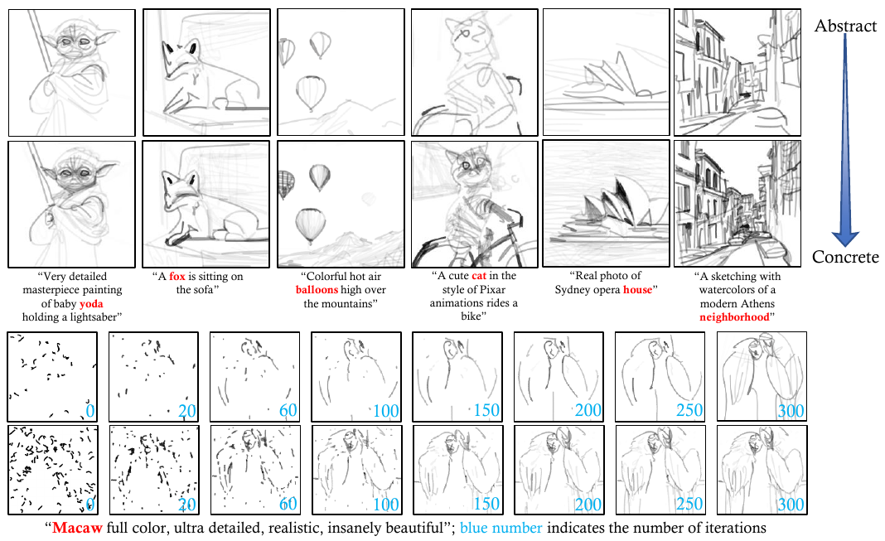
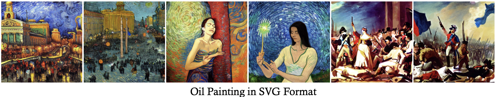

**DiffSketcher Rendering Process:**

| 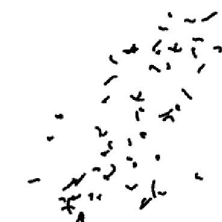            | 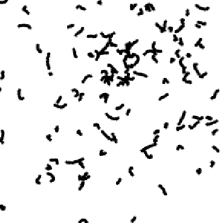                | 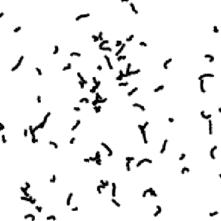 |
|-------------------------------------------------------------------------|-----------------------------------------------------------------------------|--------------------------------------------------------------|
| Prompt: Macaw full color, ultra detailed, realistic, insanely beautiful | Prompt: Very detailed masterpiece painting of baby yoda hoding a lightsaber | Prompt: Sailboat sailing in the sea on a clear day           |

## :new: Update

- [01/2024] 🔥 **We released the [SVGDreamer](https://ximinng.github.io/SVGDreamer-project/). SVGDreamer is
  a novel text-guided vector graphics synthesis method. This method considers both the editing of vector graphics and
  the quality of the synthesis.**
- [12/2023] 🔥 **We released the [PyTorch-SVGRender](https://github.com/ximinng/PyTorch-SVGRender). Pytorch-SVGRender is
  the go-to library for state-of-the-art differentiable rendering methods for image vectorization.**
- [11/2023] We thank [@camenduru](https://github.com/camenduru) for implementing
  the [DiffSketcher-colab](https://github.com/camenduru/DiffSketcher-colab).
- [10/2023] We released the DiffSketcher code.
- [10/2023] We released the [VectorFusion code](https://github.com/ximinng/VectorFusion-pytorch).

## :wrench: Installation

### Step by step

Create a new conda environment:

```shell
conda create --name diffsketcher python=3.10
conda activate diffsketcher
```

Install pytorch and the following libraries:

```shell
conda install pytorch==1.13.1 torchvision==0.14.1 torchaudio==0.13.1 pytorch-cuda=11.6 -c pytorch -c nvidia
pip install omegaconf BeautifulSoup4
pip install opencv-python scikit-image matplotlib visdom wandb
pip install triton numba
pip install numpy scipy timm scikit-fmm einops
pip install accelerate transformers safetensors datasets
```

Install CLIP:

```shell
pip install ftfy regex tqdm
pip install git+https://github.com/openai/CLIP.git
```

Install diffusers:

```shell
pip install diffusers==0.20.2
```

Install xformers (require `python=3.10`):

```shell
conda install xformers -c xformers
```

Install diffvg:

```shell
git clone https://github.com/BachiLi/diffvg.git
cd diffvg
git submodule update --init --recursive
conda install -y -c anaconda cmake
conda install -y -c conda-forge ffmpeg
pip install svgwrite svgpathtools cssutils torch-tools
python setup.py install
```

### Docker Usage

```shell
docker run --name diffsketcher --gpus all -it --ipc=host ximingxing/svgrender:v1 /bin/bash
```

## 🔥 Quickstart

### Case: Sydney Opera House

**Preview:**

|                                    Attention Map                                     |                                   Control Points Init                                   |                                Strokes Initialization                                 |                                        100 step                                         |                                          500 step                                           |
|:------------------------------------------------------------------------------------:|:---------------------------------------------------------------------------------------:|:-------------------------------------------------------------------------------------:|:---------------------------------------------------------------------------------------:|:-------------------------------------------------------------------------------------------:|
| 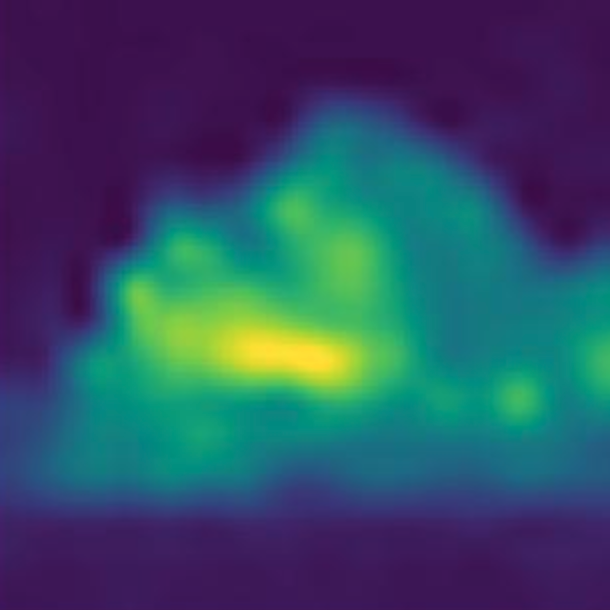 | 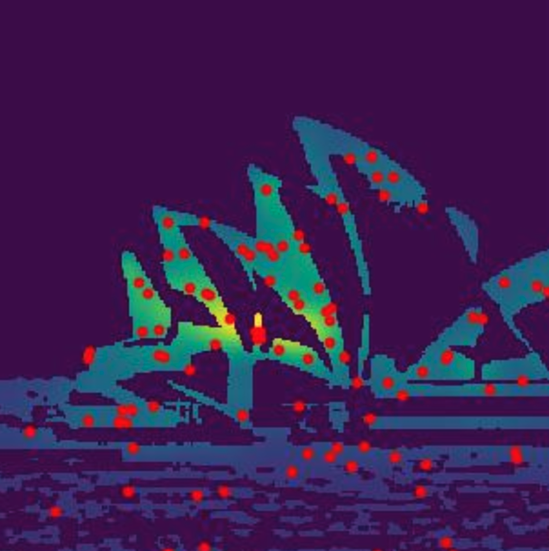 |  |  |  |

**From the abstract to the concrete:**

|                        16 Paths                        |                        36 Paths                        |                        48 Paths                        |                        96 Paths                        |                        128 Paths                        |
|:------------------------------------------------------:|:------------------------------------------------------:|:------------------------------------------------------:|:------------------------------------------------------:|:-------------------------------------------------------:|
|  |  | 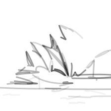 |  |  |

**Script:**

```shell
python run_painterly_render.py \
  -c diffsketcher.yaml \
  -eval_step 10 -save_step 10 \
  -update "token_ind=4 num_paths=96 num_iter=800" \
  -pt "a photo of Sydney opera house" \
  -respath ./workdir/sydney_opera_house \
  -d 8019 \
  --download
```

- `-c` a.k.a `--config`: configuration file, saving in `DiffSketcher/config/`.
- `-eval_step`: the step size used to eval the method (**too frequent calls will result in longer times**).
- `-save_step`: the step size used to save the result (**too frequent calls will result in longer times**).
- `-update`: a tool for editing the hyper-params of the configuration file, so you don't need to create a new yaml.
- `-pt` a.k.a `--prompt`: text prompt.
- `-respath` a.k.a `--results_path`: the folder to save results.
- `-d` a.k.a `--seed`: random seed.
- `--download`: download models from huggingface automatically **when you first run them**.

**crucial:**

- `-update "token_ind=4"` indicates the index of cross-attn maps to init strokes.
- `-update "num_paths=96"` indicates the number of strokes.

**optional:**

- `-npt`, a.k.a `--negative_prompt`: negative text prompt.
- `-mv`, a.k.a `--make_video`: make a video of the rendering process (**it will take much longer**).
- `-frame_freq`, a.k.a `--video_frame_freq`: the interval of the number of steps to save the image.
- `-framerate`, a.k.a `--video_frame_rate`: control the playback speed of the output video.
- **Note:** [Download](https://huggingface.co/akhaliq/CLIPasso/blob/main/u2net.pth) U2Net model and place
  in `checkpoint/` dir if `xdog_intersec=True`
- add `enable_xformers=True` in `-update` to enable xformers for speeding up.
- add `gradient_checkpoint=True` in `-update` to use gradient checkpoint for low VRAM.

### Case: Sydney Opera House in ink painting style

**Preview:**

|  |  |  |  |
|------------------------------------------------------|--------------------------------------------------------|--------------------------------------------------------|--------------------------------------------------------|
| Strokes Initialization                               | 100 step                                               | 200 step                                               | 990 step                                               |

**Script:**

```shell
python run_painterly_render.py \
  -c diffsketcher-width.yaml \
  -eval_step 10 -save_step 10 \
  -update "token_ind=4 num_paths=48 num_iter=800" \
  -pt "a photo of Sydney opera house" \
  -respath ./workdir/sydney_opera_house_ink \
  -d 8019 \
  --download
```

### Oil Painting

**Preview:**

| 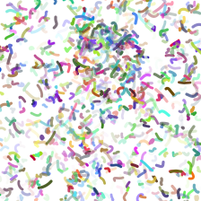 | 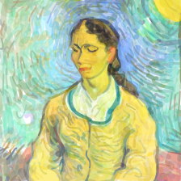 | 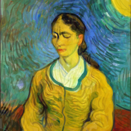 |
|----------------------------------------------------|------------------------------------------------------|------------------------------------------------------|
| Strokes Initialization                             | 100 step                                             | 570 step                                             |

**Script:**

```shell
python run_painterly_render.py \
  -c diffsketcher-color.yaml \
  -eval_step 10 -save_step 10 \
  -update "token_ind=5 num_paths=1000 num_iter=1000 guidance_scale=7.5" \
  -pt "portrait of latin woman having a spiritual awaking, eyes closed, slight smile, illuminating lights, oil painting, by Van Gogh" \
  -npt "text, signature, title, heading, watermark, ugly, duplicate, morbid, mutilated, out of frame, extra fingers, mutated hands, poorly drawn hands, poorly drawn face, mutation, deformed, blurry, bad anatomy, bad proportions, extra limbs, cloned face, disfigured, out of frame, ugly, extra limbs, gross proportions, malformed limbs, missing arms, missing legs, extra arms, extra legs, mutated hands, fused fingers, too many fingers, long neck" \
  -respath ./workdir/latin_woman_portrait -d 58548
```

**Preview:**

| 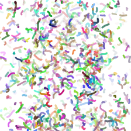 | 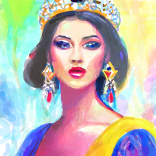 | 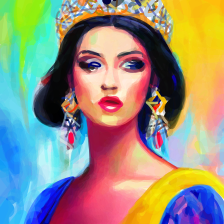 |
|------------------------------------------------|--------------------------------------------------|--------------------------------------------------|
| Strokes Initialization                         | 100 step                                         | 570 step                                         |

**Script:**

```shell
python run_painterly_render.py \
  -c diffsketcher-color.yaml \
  -eval_step 10 -save_step 10 \
  -update "token_ind=5 num_paths=1000 num_iter=1000 guidance_scale=7.5" \
  -pt "a painting of a woman with a crown on her head, art station front page, dynamic portrait style, many colors in the background, olpntng style, oil painting, forbidden beauty" \
  -npt "2 heads, 2 faces, cropped image, out of frame, draft, deformed hands, twisted fingers, double image, malformed hands, multiple heads, extra limb, ugly, poorly drawn hands, missing limb, disfigured, cut-off, ugly, grain, low-res, Deformed, blurry, bad anatomy, disfigured, poorly drawn face, mutation, mutated, floating limbs, disconnected limbs, disgusting, poorly drawn, mutilated, mangled, extra fingers, duplicate artifacts, morbid, gross proportions, missing arms, mutated hands, mutilated hands, cloned face, malformed, blur haze" \
  -respath ./workdir/woman_with_crown -d 178351
```

**Preview:**

| 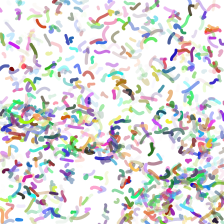 | 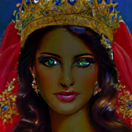 | 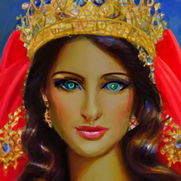 |
|-----------------------------------------------------------|-------------------------------------------------------------|-------------------------------------------------------------|
| Strokes Initialization                                    | 100 step                                                    | 420 step                                                    |

**Script:**

```shell
python run_painterly_render.py \
  -c diffsketcher-color.yaml \
  -eval_step 10 -save_step 10 \
  -update "token_ind=5 num_paths=1000 num_iter=1000 guidance_scale=7.5" \
  -pt "a painting of a woman with a crown on her head, art station front page, dynamic portrait style, many colors in the background, olpntng style, oil painting, forbidden beauty" \
  -npt "2 heads, 2 faces, cropped image, out of frame, draft, deformed hands, twisted fingers, double image, malformed hands, multiple heads, extra limb, ugly, poorly drawn hands, missing limb, disfigured, cut-off, ugly, grain, low-res, Deformed, blurry, bad anatomy, disfigured, poorly drawn face, mutation, mutated, floating limbs, disconnected limbs, disgusting, poorly drawn, mutilated, mangled, extra fingers, duplicate artifacts, morbid, gross proportions, missing arms, mutated hands, mutilated hands, cloned face, malformed, blur haze" \
  -respath ./workdir/woman_with_crown -d 178351
```

### Colorful Results

**Preview:**

|  | 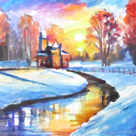 | 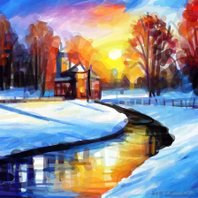 |
|---------------------------------------------|-----------------------------------------------|-----------------------------------------------|
| Strokes Initialization                      | 100 step                                      | 340 step                                      |

**Script:**

```shell
python run_painterly_render.py \
  -c diffsketcher-color.yaml \
  -eval_step 10 -save_step 10 \
  -update "token_ind=5 num_paths=1000 num_iter=800 guidance_scale=7" \
  -pt "a beautiful snow-covered castle, a stunning masterpiece, trees, rays of the sun, Leonid Afremov" \
  -npt "poorly drawn hands, poorly drawn feet, poorly drawn face, out of frame, extra limbs, disfigured, deformed, body out of frame, bad anatomy, watermark, signature, cut off, low contrast, underexposed, overexposed, bad art, beginner, amateur, distorted face" \
  -respath ./workdir/castle -d 370880
```

**Preview:**

| 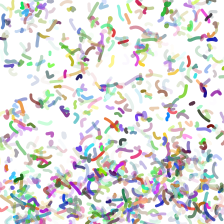 | 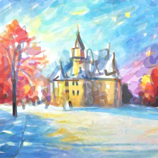 | 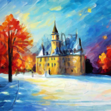 |
|-----------------------------------------------|-------------------------------------------------|-------------------------------------------------|
| Strokes Initialization                        | 100 step                                        | 850 step                                        |

**Script:**

```shell
python run_painterly_render.py \
  -c diffsketcher-color.yaml \
  -eval_step 10 -save_step 10 \
  -update "token_ind=5 num_paths=1000 num_iter=800 guidance_scale=7" \
  -pt "a beautiful snow-covered castle, a stunning masterpiece, trees, rays of the sun, Leonid Afremov" \
  -npt "poorly drawn hands, poorly drawn feet, poorly drawn face, out of frame, extra limbs, disfigured, deformed, body out of frame, bad anatomy, watermark, signature, cut off, low contrast, underexposed, overexposed, bad art, beginner, amateur, distorted face" \
  -respath ./workdir/castle -d 478376
```

### DiffSketcher + Style Transfer

**Preview:**

| 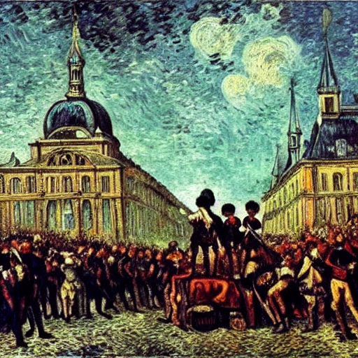 |  | 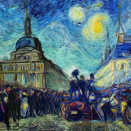 |
|------------------------------------------------------------------------------------------|-------------------------------------------------------------------|------------------------------------------------------------------------------------------|
| Generated sample                                                                         | Style Image                                                       | Result                                                                                   |

**Script:**

```shell
python run_painterly_render.py \
  -tk style-diffsketcher -c diffsketcher-style.yaml \
  -eval_step 10 -save_step 10 \
  -update "token_ind=4 num_paths=2000 style_warmup=0 style_strength=1 softmax_temp=0.4 sds.grad_scale=0 lr_scheduler=True num_iter=2000" \
  -pt "The French Revolution, highly detailed, 8k, ornate, intricate, cinematic, dehazed, atmospheric, oil painting, by Van Gogh" \
  -style ./img/starry.jpg \
  -respath ./workdir/style_transfer \
  -d 876809
```

- `-style`: the path of style img place.
- `style_warmup`:  add style loss after `style_warmup` step.
- `style_strength`:  How strong the style should be. 100 (max) is a lot. 0 (min) is no style.

### More Sketch Results

**check the [Examples.md](https://github.com/ximinng/DiffSketcher/blob/main/Examples.md) for more cases.**

### TODO

- [x] Add a webUI demo.
- [x] Add support for colorful results and oil painting.

## :books: Acknowledgement

The project is built based on the following repository:

- [BachiLi/diffvg](https://github.com/BachiLi/diffvg)
- [yael-vinker/CLIPasso](https://github.com/yael-vinker/CLIPasso)
- [huggingface/diffusers](https://github.com/huggingface/diffusers)

We gratefully thank the authors for their wonderful works.

## :paperclip: Citation

If you use this code for your research, please cite the following work:

```
@inproceedings{xing2023diffsketcher,
    title={DiffSketcher: Text Guided Vector Sketch Synthesis through Latent Diffusion Models},
    author={XiMing Xing and Chuang Wang and Haitao Zhou and Jing Zhang and Qian Yu and Dong Xu},
    booktitle={Thirty-seventh Conference on Neural Information Processing Systems},
    year={2023},
    url={https://openreview.net/forum?id=CY1xatvEQj}
}
```

## :copyright: Licence

This work is licensed under a MIT License.