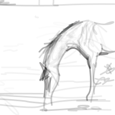

# RUN

## # DiffSketcher:

**JVSP + ASDS fine-tuning (horse)**

```shell
# canvas_size: 224
CUDA_VISIBLE_DEVICES=0 python run_painterly_render.py -c diffsketcher.yaml -eval_step 10 -save_step 10 -update "token_ind=2 num_paths=96" -pt "A horse is drinking water by the lake" -respath ./workdir/draw_horse -d 998
# canvas_size: 600
CUDA_VISIBLE_DEVICES=0 python run_painterly_render.py -c diffsketcher.yaml -eval_step 10 -save_step 10 -update "token_ind=2 num_paths=96 image_size=600 width=3.5" -pt "A horse is drinking water by the lake" -respath ./workdir/draw_horse -d 998
```

For the first command, you will get the following result:



**train from scratch via ASDS loss (horse)**

```shell
CUDA_VISIBLE_DEVICES=0 python run_painterly_render.py -c diffsketcher.yaml -eval_step 10 -save_step 10 -update "token_ind=2 num_paths=96 sds.grad_scale=2 sds.warmup=0 clip.vis_loss=0 perceptual.coeff=0 num_iter=2000 opacity_delta=0.2" -pt "A horse is drinking water by the lake" -respath ./workdir/draw_horse -d 998
```

**train from scratch via ASDS loss + SDXL (horse)**

```shell
CUDA_VISIBLE_DEVICES=0 python run_painterly_render.py -c diffsketcher.yaml -eval_step 10 -save_step 10 -update "image_size=1110 token_ind=2 num_paths=96 sds.grad_scale=2 sds.warmup=0 sds.crop_size=1024 clip.vis_loss=0 perceptual.coeff=0 opacity_delta=0.2 num_iter=2000 model_id=sdxl" -pt "A horse is drinking water by the lake" -respath ./workdir/draw_horse -d 998
```

**JVSP + ASDS fine-tune (horse) + including width**

```shell
CUDA_VISIBLE_DEVICES=0 python run_painterly_render.py -c diffsketcher-width.yaml -eval_step 10 -save_step 10 -update "token_ind=2 num_paths=128 sds.warmup=1500 num_iter=2000 grad_scale=1e-6" -pt "A horse is drinking water by the lake" -respath ./workdir/draw_horse_width -d 998
```

Result:


---

**More examples**

- Mushroom

```shell
CUDA_VISIBLE_DEVICES=0 python run_painterly_render.py \
-c diffsketcher.yaml \
-eval_step 10 -save_step 10 \
-update "token_ind=4 num_paths=84 comp_idx=0 attn_coeff=1 softmax_temp=0.4 xdog_intersec=False sds.num_aug=4 sds.grad_scale=2 sds.warmup=0 clip.vis_loss=0 clip.num_aug=4 clip.text_visual_coeff=0 perceptual.coeff=0 opacity_delta=0.2 lr_scheduler=True num_iter=3000"
-pt "a brightly colored mushroom growing on a logt, minimal 2d line drawing. trending on artstation." \
-respath ./workdir/Mushroom \
-d 621024
```

You will get the following result:


- Elephant

```shell
CUDA_VISIBLE_DEVICES=0 python run_painterly_render.py \
-c diffsketcher.yaml \
-eval_step 10 -save_step 10 \
-update "token_ind=5 attention_init=True num_paths=64 comp_idx=0 attn_coeff=1 softmax_temp=0.4 xdog_intersec=False sds.num_aug=4 sds.grad_scale=1 sds.warmup=0 clip.vis_loss=0 clip.num_aug=4 clip.text_visual_coeff=0 perceptual.coeff=0 lr_scheduler=True num_iter=2000 opacity_delta=0.6" \
-pt "the silhouette of an elephant on the full moon, minimal 2d line drawing. trending on artstation." \
-respath ./workdir/zeleSDS84 \
-d 211710
```

You will get the following result:


- Yoda

```shell
CUDA_VISIBLE_DEVICES=0 python run_painterly_render.py \ 
-c diffsketcher.yaml \
-eval_step 10 -save_step 10 \
-update "token_ind=7 num_paths=96 sds.warmup=1500 num_iter=2000" \ 
-pt "Very detailed masterpiece painting of baby yoda hoding a lightsaber, portrait, artstation, concept art by greg rutkowski" \ 
-respath ./workdir/draw_horse \ 
-d 998
```

- Fox

```shell
CUDA_VISIBLE_DEVICES=0 python run_painterly_render.py \ 
-c diffsketcher.yaml \
-eval_step 10 -save_step 10 \
-update "token_ind=2 num_paths=64 softmax_temp=0.5 sds.grad_scale=1e-6 num_iter=2000" \ 
-pt "A fox is sitting on the sofa" \ 
-respath ./workdir/fox \ 
-d 9007
```

- Balloons

```shell
CUDA_VISIBLE_DEVICES=0 python run_painterly_render.py \
-c diffsketcher.yaml \
-eval_step 10 -save_step 10 \
-update "token_ind=4 num_paths=128 softmax_temp=0.5 sds.grad_scale=1e-6 mask_object=False num_iter=4000" \
-pt "Colorful hot air balloons high over the mountains" \ 
-respath ./workdir/balloons \
-d 9998
```

- Cat

```shell
CUDA_VISIBLE_DEVICES=0 python run_painterly_render.py  \
-c diffsketcher.yaml \
-eval_step 10 -save_step 10 \
-update "token_ind=2 num_paths=48 ssoftmax_temp=0.5 sds.grad_scale=1e-6 mask_object=False" \
-pt "A cute cat in the style of Pixar animations, wearing a helmet and riding a bike" \
-respath  ./workdir/cat \
-d 8030
```

- Sydney opera house

```shell
CUDA_VISIBLE_DEVICES=0 python run_painterly_render.py \ 
-c diffsketcher.yaml \
-eval_step 10 -save_step 10 \
-update "token_ind=6 num_paths=96 sds.warmup=1500 num_iter=2000" \ 
-pt "Real photo of Sydney opera house" \ 
-respath ./workdir/house \ 
-d 8019 
```

- Neighborhood

```shell
CUDA_VISIBLE_DEVICES=0 python run_painterly_render.py \ 
-c diffsketcher.yaml \
-eval_step 10 -save_step 10 \
-update "token_ind=11 num_paths=96 softmax_temp=0.5 sds.grad_scale=1e-6 num_iter=2000" \ 
-pt "A loose ink sketching with watercolors of a modern Athens neighborhood, architectural, detailed, old building and new buildings, quiet street" \ 
-respath ./workdir/neighborhood \ 
-d 42
```

- Macaw

```shell
CUDA_VISIBLE_DEVICES=0 python run_painterly_render.py \ 
-c diffsketcher.yaml \
-eval_step 10 -save_step 10 \
-update "token_ind=1 num_paths=96 sds.warmup=1500 num_iter=2000" \ 
-pt "macaw full color, ultra detailed, realistic, insanely beautiful" \ 
-respath ./workdir/macaw \ 
-d 8091
```

- Bunny

```shell
CUDA_VISIBLE_DEVICES=0 python run_painterly_render.py \ 
-c diffsketcher.yaml \
-eval_step 10 -save_step 10 \
-update "token_ind=5 num_paths=96 softmax_temp=0.5 num_iter=2000" \ 
-pt "portrait of two white bunnies, super realistic, highly detailed" \ 
-respath ./workdir/bunny \ 
-d 9001
```

- Dragon

```shell
CUDA_VISIBLE_DEVICES=0 python run_painterly_render.py \
-c diffsketcher.yaml \
-eval_step 10 -save_step 10 \
-update "token_ind=2 num_paths=32 softmax_temp=0.5 mask_object=True" \
-pt "A dragon flying in the sky, full body" \
-respath ./workdir/dragon  \
-d 8023
```

- Unicorn

```shell
CUDA_VISIBLE_DEVICES=0 python run_painterly_render.py \
-c diffsketcher.yaml \
-eval_step 10 -save_step 10 \
-update "token_ind=2 num_paths=128 softmax_temp=0.5" \ 
-pt "A unicorn is running on the grassland" \
-respath ./workdir/unicorn \
-d 9998
```

